# 2 How to use the model

The tool is worked left to right. Four numbered tabs run across the top of the screen, and each one
hands its output to the next: **Data Inputs**, **BAU Scenario**, **Intervention Design**, and
**Results Dashboard**. A user who fills the tabs in order will have a complete scenario by the time
they reach the fourth.

Two controls sit above the tabs and govern everything below them. The **Select geographical scope**
dropdown decides whether the analysis covers urban and rural separately, one area alone, or a
single national dataset. The **Water Supply / Sanitation** toggle decides which sector the input
forms are editing. Users switch between the two sectors to complete both.

This section takes the tabs one at a time. Section 2.1 covers the help material and the saving
controls, which sit outside the tabs and apply throughout. Sections 2.2 to 2.5 cover one tab each,
and within each tab one subsection per on-screen section.

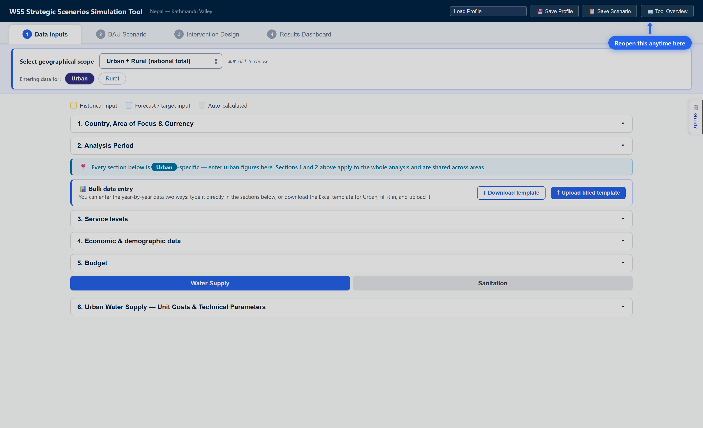

**Figure 2.0. The tool on opening.** The four numbered tabs run across the top. The two controls
that govern everything below them sit in the blue panel: the geographical scope dropdown and the
Urban / Rural entry buttons. Work down the numbered sections from there.

---

## 2.1 Help material and saving your work

Four features sit outside the four tabs. The Tool Overview modal explains the workflow, the Load
Profile dropdown and Save Profile button hold complete datasets, the Save Scenario button holds
snapshots for comparison, and the Guide panel gives field-by-field help. The first three live in
the dark header strip across the top. The fourth opens from the right edge of the screen.

The distinction between a profile and a scenario matters, because the two are stored in different
places. A **profile** is written to the server and is available to anyone using the same
deployment. A **scenario** is written to the browser and never leaves the machine.

### 2.1.1 Tool overview button

The Tool Overview modal is the tool's built-in onboarding. It opens automatically on every page
load, not only the first.

The modal has two internal tabs. **How to use this tool** walks through the four tabs in order.
**Saving your work** explains the profile and scenario buttons. The modal always opens on the first
of the two, and it does not remember which one was last read.

There is no close cross. Use either **Get Started** button, one beside the title and one across the
bottom, or click the dark area outside the panel. Reopen the modal at any time with the **📖 Tool
Overview** button at the top right.

Closing the modal for the first time on a new machine triggers a one-time prompt. The geographical
scope card pulses and a blue **👈 Start here** pill appears for about ten seconds. It does not
appear again.

One caution while reading the modal. Its amber note stating that the Results Dashboard shows static
example charts is out of date. The dashboard runs the live calculation engine.

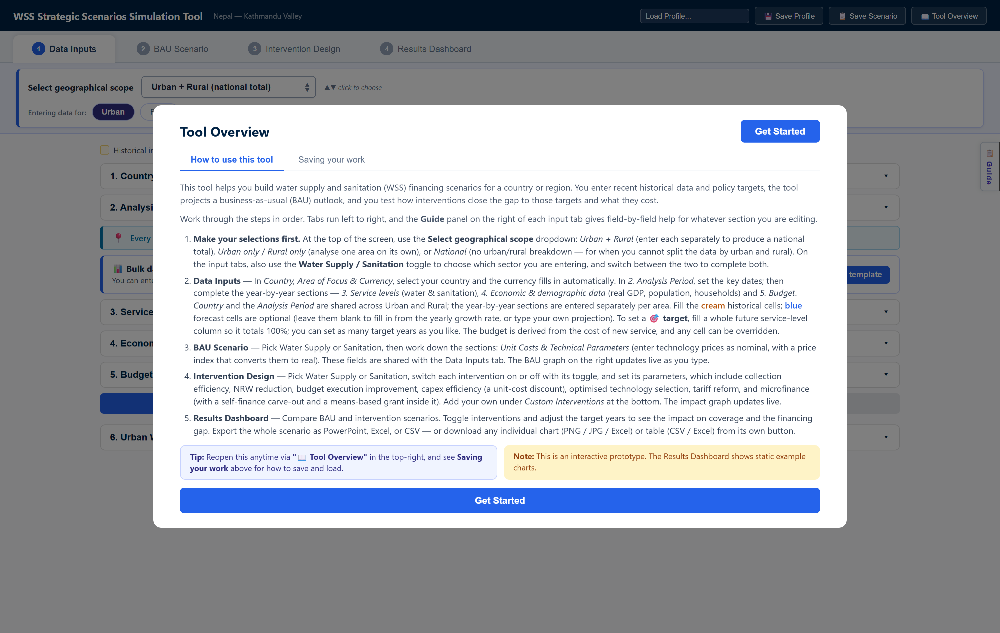

**Figure 2.1. The Tool Overview modal, which opens on every page load.** The two internal tabs sit
under the title. The numbered list summarizes each of the four tabs in turn. Either **Get Started**
button closes it.

### 2.1.2 User profile saving and choosing

A profile is a complete, reloadable dataset for a place. It holds the country settings, the
year-by-year data, the unit costs, and every intervention parameter.

**To load one**, open the **Load Profile…** dropdown at the top right. It offers three groups:

- **Nepal KV (Default)** loads the built-in Kathmandu Valley dataset. Use it to see a fully
  populated example.
- **── New Blank Country ──** clears the data for a fresh country.
- **── Saved Profiles ──** lists everything saved on this deployment.

**To save one**, click **💾 Save Profile** and type a name. The profile is written to the server.

Four consequences follow from profiles being server-side files, and users should know all four.
Everyone on the same deployment sees the same list and can load anyone else's work. Saving under an
existing name overwrites it without warning. There is no way to rename or delete a profile from the
screen, which has to be done on the server. And nothing on screen shows which profile is currently
loaded, since the header subtitle only echoes the Country and Area of focus typed into section 1.

Two further points on loading. Loading anything replaces the entire dataset immediately, with no
confirmation and no undo. And **New Blank Country** is not completely blank: the analysis period,
the intervention parameters, the income distribution, and the service-level names all survive.
Reset the analysis period by hand after choosing it.

**Figure 2.2. The session controls at the right of the header strip.** From the left: the Load
Profile dropdown, Save Profile, Save Scenario, and Tool Overview. The tool name and a subtitle
echoing the country and area typed into section 1 sit at the far left of the same strip.

### 2.1.3 Scenario saving and choosing

A scenario is a snapshot of the current inputs, kept so it can be compared against another. Save
one version as "Ambitious 2040", change the assumptions, then save another as "Conservative 2040".

**To save**, click **📋 Save Scenario** and type a name. The scenario is written to the browser
only. It disappears if site data is cleared, and it does not follow the user to another machine or
another browser.

**To reload or delete**, use the pale blue **Saved scenarios:** bar directly under the header. It
appears once at least one scenario exists, and it is the only place these actions are available.
Click a scenario's chip to load it back. Click its **✕** to delete it. Neither action asks for
confirmation, and loading overwrites unsaved work.

The **📑** icon on each chip downloads that scenario as a branded PowerPoint deck. The same
scenarios appear again as cards at the bottom of the Results Dashboard, where the button is labeled
**📑 Export slides**. Those cards export only. They cannot load or delete.

Work in progress is saved automatically to the browser about a second after every change and
restored on reload. A refresh therefore loses nothing. It also resets nothing, so use **New Blank
Country** for a genuinely clean start.

**Figure 2.3. The saved scenarios bar, with two versions saved for comparison.** Click a name to
load that scenario back. The 📑 icon beside it exports that scenario as a slide deck, and the ✕
deletes it without asking.

### 2.1.4 Navigate the side guide

The Guide panel gives field-by-field help for whatever section is open. It is available on the
first three tabs and opens from the vertical **📋 Guide** button on the right edge. The button
reads **✕ Close** while the panel is open. There is no Guide on the Results Dashboard.

The panel holds one collapsible card per form section. Click a card to expand it. Most cards carry
a **How to find it** list naming the datasets a user should go to, and a **Sources:** line with
links.

The panel follows the form. Opening a section on the left focuses the matching card and opens the
panel if it was closed. One quirk is worth knowing: after closing the panel with **✕ Close**,
clicking the *same* section again will not reopen it. Move to a different section instead.

The card list differs by tab. On Data Inputs and BAU Scenario, both the water and the sanitation
unit-cost cards always appear, whichever sector is selected. On Intervention Design the cards are
filtered to the selected sector, so a user looking for water guidance must switch the sector toggle
to Water Supply.

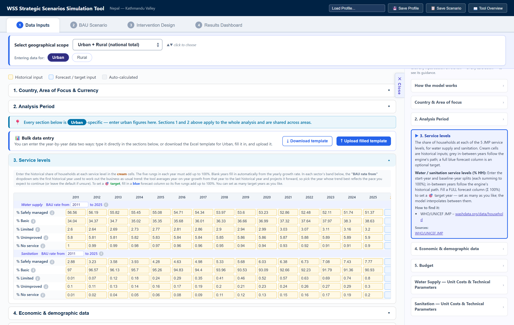

**Figure 2.4. The Guide panel follows the section being edited.** Opening section 3 on the left
expanded its card on the right. The card explains the fields, then gives a **How to find it** list
and a **Sources:** link, which for service levels is the WHO/UNICEF JMP household database.

---

## 2.2 Data Input

The first tab collects everything the model needs before it can project anything. Work down the
five numbered sections in order. Sections 1 and 2 apply to the whole analysis and are shared across
areas. Sections 3 onward are specific to the area named in the **Entering data for** buttons, and a
pin note on screen states which area is being edited.

Every year-by-year table uses the same three-color convention, shown in the legend at the top of
the tab:

| Color | Legend label | Meaning |
|---|---|---|
| Cream | Historical input | Enter a value. These drive everything. |
| Blue | Forecast / target input | Optional. Leave blank to fill from the growth rate, or type a projection. A fully completed forecast column becomes a target. |
| Grey | Auto-calculated | The model's own figure. Type over it to override that year. |

**Two ways to enter the data.** Type directly into the sections below, or use the **📊 Bulk data
entry** panel: click **⤓ Download template** for an Excel file already laid out for the selected
area, fill it in offline, and load it back with **⤒ Upload filled template**. Download a separate
template for each area.

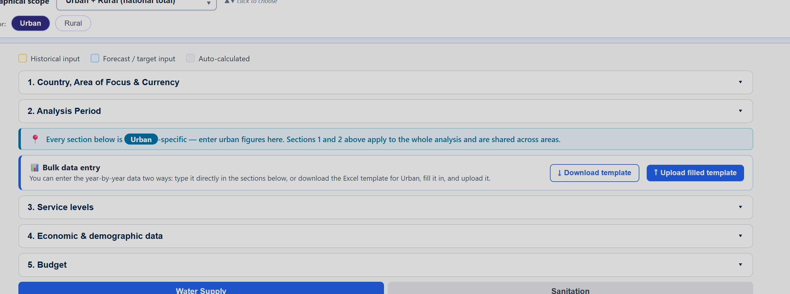

**Figure 2.5. The colour legend and the bulk entry panel.** The legend across the top defines the
three cell types used in every table below. The pin note states which area the sections below
belong to. The bulk entry panel offers the Excel template route as an alternative to typing.

### 2.2.1 Country, Area of Focus & Currency

**Where to find the data.** Nothing external is needed. The World Bank country classification is
the reference behind the country list.

**How the data should be entered.** The **Country** box is a free-text field with an autocomplete
list, not a true dropdown. Type a few letters and pick from the suggestions. An exact match fills
the **Currency code** automatically. **Area of focus** is a free label, shown in the header and
carried into exports.

Two cautions. The country box accepts any text, so a misspelling is taken silently and leaves
the previous currency in place. And the currency auto-fill is one way: re-typing the country name
re-applies its mapped currency and discards a manual override, so set the currency last if it
needs changing.

The list covers low- and middle-income countries. Users working on a high-income country should
type the name and enter the currency code by hand.

### 2.2.2 Analysis Period

**Where to find the data.** These are choices, not data. They should follow the planning horizon of
the strategy the analysis supports.

**How the data should be entered.** Three dates define the run:

- **Model Start Year.** The first year of the analysis. The model builds its historical record from
  here to the last historical year.
- **Last year of historical data.** The most recent year with complete data. This must be within
  three years of the present.
- **Forecast End Year.** The last year of the projection. It must be in the future.

The model needs at least two historical years of data, separated by at least two years, to build a
sound business-as-usual trend. With a last historical year of 2026, for example, the model start
year should be 2022 or earlier, with data entered for 2022 and 2024.

There is no target-year field here. Targets are set in section 3.

### 2.2.3 Service levels

**Where to find the data.** The WHO/UNICEF Joint Monitoring Programme household data, at
washdata.org/data/household, covers both sectors and all five levels for most countries.

**How the data should be entered.** Enter the share of households at each of the five service
levels, for water supply and for sanitation, in the cream cells. The five levels must add up to 100
percent in every year entered. Blank years fill in automatically from the yearly growth rate, so a
user with only two or three historical points can still proceed.

Each sector band carries a **BAU rate from** dropdown. It sets the first historical year used to
work out the business-as-usual trend. The model averages year-on-year growth from that year to the
last historical year and projects it forward, so choose the year whose trend best reflects the pace
expected to continue. Leave the default if unsure.

**To set a target**, fill in a blue forecast column so that its five levels add up to 100 percent.
The column header then shows a 🎯 marker. Set as many target years as needed. The model
interpolates between consecutive targets.

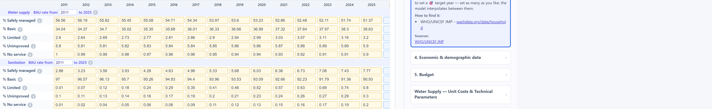

**Figure 2.6. The historical block of the service levels table.** Each sector has its own band of
five rungs, and the five must add up to 100 percent in each year. The **BAU rate from** dropdown
beside the sector name sets the first year of the trend the model projects forward.

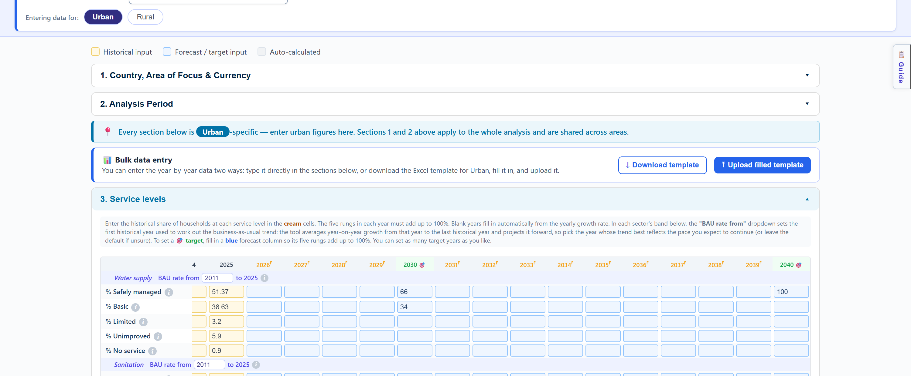

**Figure 2.7. The same table scrolled to the forecast years, where targets are set.** The pale blue
columns are optional. Two of them here have been completed to 100 percent, so 2030 and 2040 carry
the 🎯 marker and are highlighted green. Every other forecast column is left blank and fills itself
from the growth rate.

### 2.2.4 Economic & demographic data

**Where to find the data.** Three series, each with a standard source:

| Field | Where to find it |
|---|---|
| Real GDP (local currency, millions) | World Bank indicator NY.GDP.MKTP.KN, GDP in constant local currency. Also the IMF World Economic Outlook Database, or the central bank or national statistics office. |
| Population | World Bank indicator SP.URB.TOTL, or UN World Urbanization Prospects. For sub-national figures, the national statistics office. |
| Households (millions) | The national statistics office or census bureau. Also the UN Statistics Division. |

Estimate households by dividing the population by the average household size wherever the household
data itself is unavailable.

**How the data should be entered.** Fill the cream historical cells. Leave blue forecast cells
blank to fill them at the mean historical growth rate, or type a projection where a better one
exists. The grey **→ used** rows show the values the model actually applies, which is the quickest
way to check that a projection came out as intended.

Real GDP must be at constant base-year prices. It drives the forecast budget, so an error here
propagates to every financing result.

### 2.2.5 Budget

**Where to find the data.** The Ministry of Finance budget documents and budget execution reports
give the allocated figures. The sector ministry responsible for water supply and sanitation holds
the rest. Both budgets are computed for the user, so this section can often be left alone.

**How the data should be entered.** Two budgets are shown per sector, and the difference between
them is the point of the section:

- **Executed budget** is the capital that actually gets put to work building new service. The model
  computes it historically from the cost of the new households served, and forecasts it from the
  average historical budget-to-GDP ratio applied to real GDP. This is what drives the
  business-as-usual result.
- **Allocated budget** is the capital budget on paper. It is normally larger. Its historical
  default implies roughly 77 percent budget execution, and its forecast follows the mean historical
  ratio between the two.

The ratio of executed budget to allocated budget is the **budget execution** rate, which the Budget
execution improvement intervention raises toward 100 percent. Enter the real allocated figures
wherever they are available, since the default is only a placeholder and this intervention is
measured against it.

Type in any cell to override that year. Blanks fill from the model.

---

## 2.3 BAU

The second tab has the input form on the left and the live business-as-usual charts on the right.
The charts redraw as the user types, so this is the tab for testing how sensitive the outlook is to
a cost or a technical assumption.

A link note at the top of the form states that these fields are synced with the Data Inputs tab.
Editing them here or there is the same thing.

### 2.3.1 Unit Costs & Technical Parameters

**Where to find the data.** The utility's own service costs and average technology prices are the
best source. The WHO/UNICEF JMP service ladders define which technology counts as which service
level, and IBNET publishes utility benchmarks where local figures are missing.

**How the data should be entered.** The capital cost per household is built from **two technology
mixes**, one for safely managed service and one for basic. For each technology, enter its share of
the mix and its cost per household. The model uses each table's share-weighted total.

The two sectors behave differently, and the difference confuses new users:

- **For water**, the two rungs use **different** technologies. Safely managed comes from
  on-premises improved sources that are available when needed and free from contamination. Basic
  comes from shared or communal supplies such as a public standpipe or a water kiosk.
- **For sanitation**, both tables list the **same** technologies. The service level is set by
  service attributes, namely sharing, emptying, and treatment, rather than by the hardware. An
  identical flush-to-septic-tank toilet is limited if shared, basic if emptied but discharged
  locally, and safely managed if contained or emptied and treated off site. Raise the
  safely-managed table to reflect containment, safe emptying, and off-site treatment.

Enter costs as **nominal** prices for the price-index year. The model converts them to real terms
using the index.

The technical parameters below the tables feed the calculation directly. The asset useful life
drives the replacement capital charge. The non-household share scales total capital above household
capital, since the network also serves businesses and institutions.

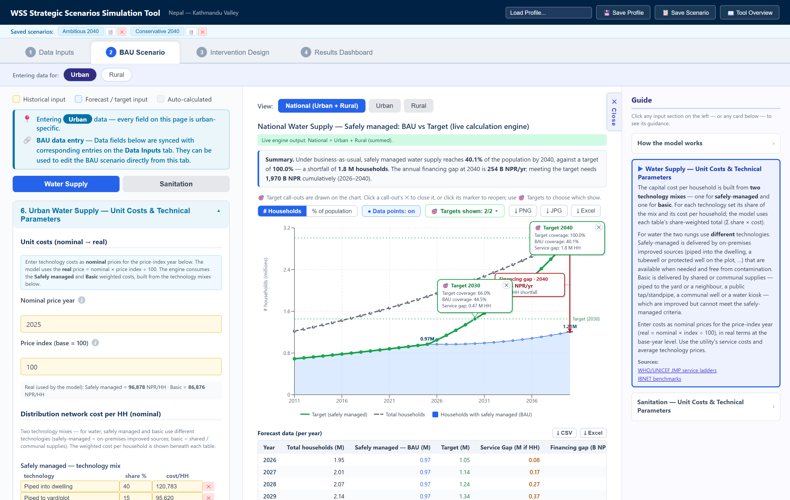

**Figure 2.8. The two technology mixes that set the cost of a connection.** The safely-managed mix
and the basic mix are entered separately, each as a set of technologies with a share and a cost per
household. The weighted total of each table is the unit cost the model uses.

### 2.3.2 How to read the BAU graph

**How the output is produced.** The chart is drawn by the live calculation engine from the inputs
on tabs 1 and 2. Nothing on this tab needs to be run or refreshed.

**Choosing what is shown.** The **View** selector above the chart switches between **National
(Urban + Rural)**, **Urban**, and **Rural**. The chart title and the subtitle state which is being
shown and confirm that national is the sum of the two areas.

**The written summary.** A sentence directly under the title states the result in words. For the
default dataset it reads: under business as usual, safely managed water supply reaches 40.1 percent
of the population by 2040 against a target of 100 percent, a shortfall of 1.8 million households,
with an annual financing gap at 2040 of 254 billion NPR. This sentence is generated from the same
numbers as the chart and is the fastest way to read the result.

**Graph elements.** Four things are drawn:

- **Households with safely managed (BAU)** is the projection on current budgets and current
  performance.
- **Target (safely managed)** is the path implied by the target columns entered in section 3.
- **Total households** is the ceiling, the whole population of the area.
- **🎯 target call-outs** are boxes pinned to each target year, giving target coverage, BAU
  coverage, and the service gap between them.

**How that compares to the target.** Read the vertical distance between the BAU line and the target
line at a target year. That distance is the service gap, and the call-out states it in households.
A separate badge in the corner of the chart gives the financing gap for the final year, which is
what that distance costs.

**Controls.** Switch the y-axis between **# Households** and **% of population**. Turn **Data
points** on or off. Use **🎯 Targets shown** to choose which call-outs are drawn. Close a call-out
with its **✕** and reopen it by clicking its marker. Export the chart with **⤓ PNG**, **⤓ JPG**, or
**⤓ Excel**.

**Two charts, not one.** The safely managed chart is followed by a second chart for basic service,
built the same way. Basic coverage often runs above its target, in which case the service gap is
zero and the model reports no cost.

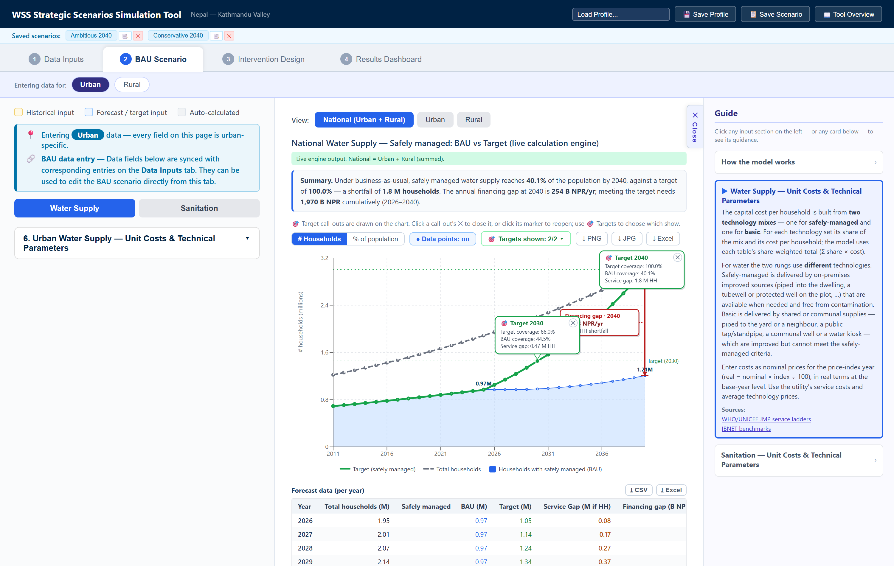

**Figure 2.9. The business-as-usual chart, read against the target.** The blue area is coverage on
current budgets. The green line is the target path, and the grey dashed line is the total
population. The distance between blue and green at a target year is the service gap, which each
🎯 call-out states in households. The red badge gives what that gap costs in the final year. The
summary above the chart says the same thing in a sentence, and the table below gives the figures
year by year.

### 2.3.3 Forecast data (per year)

Below each chart is the same result as a table, year by year: total households, safely managed
under BAU, the target, the service gap, and the annual financing gap. Export it with **⤓ CSV** or
**⤓ Excel**.

Use this table to read exact values off the chart, and to check that a target year landed where it
was meant to.

---

## 2.4 Intervention

The third tab is where the analysis moves from diagnosis to options. The gaps measured on the BAU
tab are fixed. This tab tests what closes them.

Interventions are configured **per area**. A pin note states which area is being edited, and the
**Water Supply / Sanitation** toggle chooses the sector. Both sectors need setting up separately.

Each intervention has two independent controls. The **checkbox** switches it on, which adds it to
the impact graph. The **▾ Show** button opens its parameters, and **▴ Hide** collapses them again.
Parameters can be reviewed without switching the intervention on, and switching an intervention off
never clears what was entered.

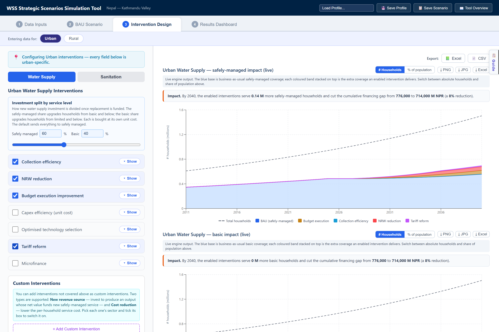

**Figure 2.10. The Intervention Design tab.** The investment split sits above the levers, because it
governs all of them. Each intervention below has a checkbox that enables it and a **▾ Show** button
that opens its parameters. Two graphs sit on the right, safely managed above and basic below, each
stacking one coloured band per enabled intervention on its blue business-as-usual base, with buttons
to switch the axis between households and share of population.

### 2.4.1 Investment split by service level

**This is the first thing to set on the tab, and it is not an intervention.** It has no checkbox,
because it is an assumption about how the sector spends rather than a lever you switch on. It
therefore moves the business-as-usual curve as well as the designed scenario.

**What it does.** Once replacement is funded, the remaining capital is divided between two service
levels. The **safely managed** share upgrades households from basic and below. The **basic** share
upgrades households from limited and below. Each share buys households at that level's own unit
cost, so a given sum buys more basic connections than safely-managed ones.

**How to set it.** Type into either percentage field or drag the slider. The pair always totals 100.
The default sends everything to safely managed, which reproduces a model that only ever buys the top
level.

**What to expect.** Moving the slider toward basic lowers safely-managed coverage and raises basic
coverage. Both gaps are priced, so the financing gap responds to both. There is usually an interior
optimum rather than a corner. The sample dataset reaches its lowest total investment need at around
a 50/50 split, because pushing further closes the basic gap but reopens the safely-managed one
faster than it saves.

Two mechanics worth knowing. Both flows are drawn from the previous year's household counts, so no
household climbs two levels and is charged twice in one year. And a share whose source households
have run out rolls over to the other level rather than going unspent, so no capital is wasted.

**Set the split before reading anything else on the tab**, since every intervention below is
measured on top of it.

### 2.4.2 Water Supply Interventions

**Where to find the data.** Almost everything on this tab comes from the water utility rather than
from a statistical agency: the billing system for collected ratios and tariffs, the production and
distribution records for volumes and losses, and the capital budget for execution rates. IBNET
benchmarks give a defensible starting point wherever a utility figure is unavailable.

**How the data should be entered.** Seven interventions are offered. Each asks for a start year and
in most cases a target year, which together set how fast the change is phased in.

- **Collection efficiency.** Raises the share of billed revenue actually collected. Enter the
  improvement start year, target year, current and target collection ratios, the volume sold at the
  start year, its growth rate, and the current tariff.
- **NRW reduction.** Cuts non-revenue water. Enter the start and target years, current and target
  NRW percentages, and the split between commercial and physical losses. Then enter the system
  input volume at the start year and its growth rate, the water needed for one basic-to-safely-
  managed upgrade, the cost of fixing, and the value of the recovered water as either a production
  cost or a water tariff. A **benefit lag** field sets how many years pass between the works and
  the recovered water.
- **Budget execution improvement.** Raises the share of the allocated budget that reaches service.
  Enter current and target budget execution, plus the start and target years. The current figure
  should match the budget section on tab 1.
- **Capex efficiency (unit cost).** Discounts the cost of a connection. Enter the start year,
  target year, and the capex efficiency improvement to be achieved.
- **Optimised technology selection.** Opens **two mix editors**, one for safely managed and one for
  basic, since both levels are purchased. Each re-specifies its mix and changes that level's unit
  cost in a single step from the start year, and each shows the new cost against the BAU cost with
  the percentage change. Both are pre-filled as a no-op, so the lever produces no effect until a mix
  is actually changed.
- **Tariff reform.** Raises the tariff. Enter the start and target years, the volume sold at the
  start year, and the current and target tariffs.
- **Microfinance.** Finances households the budget cannot reach. Enter the connection fee, the
  start and end years, the share of the gap that can pay upfront, the loan interest rate in real
  terms, the loan tenor, and the take-up rate. Two further fields cover households who can pay part
  of the upfront fee. A **grant budget** field funds a one-time means-based grant pool for
  households who cannot service a full loan.

### 2.4.3 Sanitation Interventions

**Where to find the data.** The sewerage utility or the municipal sanitation department. Where
sanitation is not separately metered, the water utility's volumes and the wastewater collected
share are the usual basis.

**How the data should be entered.** Seven interventions again, five of them the same mechanism as
their water equivalents:

- **Collection efficiency.** Inherits the water utility's collection ratio. Enter the start and
  target years and the **sewer tariff as a percentage of the water tariff**.
- **Budget execution improvement**, **Capex efficiency (unit cost)**, and **Optimised technology
  selection** work exactly as they do for water, with sanitation's own figures.
- **NRW-linked sanitation revenue.** The only intervention that crosses between sectors. The
  physical water recovered by the water NRW intervention returns to the sewer as wastewater the
  utility can charge for. Enter the wastewater return ratio, the sewer charge, and the collection
  rate. This intervention produces nothing unless **NRW reduction** is also switched on in the
  water sector, because there would be no recovered water to charge for.
- **Tariff reform.** Enter the start and target years, the volume billed at the start year, and the
  current and target sewer tariffs.
- **Microfinance.** The same mechanism as water, with sanitation's own connection cost, loan terms,
  and grant pool.

### 2.4.4 Custom Interventions

Interventions the tool does not provide can be added here. Click **+ Add Custom Intervention**,
choose its sector, and tick its box to switch it on. Two types are supported:

- **New revenue source.** Invest to produce an output whose net value funds new safely managed
  service. Enter the cost to implement, the time over which it is spent, and the output produced
  and its value.
- **Cost reduction.** Lower the per-household service cost from a start year, either by a
  percentage or by a fixed amount.

Custom interventions drive the calculation exactly as the built-in ones do. They appear on the
charts as a single combined band rather than one band each, and they are not itemized in the
contribution tables on the Results Dashboard.

### 2.4.5 How to navigate the graphs

**There are two graphs, not one.** The first covers safely managed service and the second covers
basic, because investment can be directed at either. They are built identically and each carries its
own unit toggle and exports. Read them together: a split that moves households into basic shows a
thinner safely-managed stack and a thicker basic one.

**How the output is produced.** Each graph runs the calculation once with every intervention off,
then once more for each intervention switched on, adding them one at a time. The households each
run adds become that intervention's band.

**How to read it.** The blue base is business-as-usual coverage at that graph's service level. Each colored band
stacked on top is the extra households one enabled intervention delivers. The top of the stack is
the full designed scenario. A written **Impact** sentence above the chart states how many more
households the enabled set serves by the final year and how far it cuts the cumulative financing
gap.

**Choosing the units.** The **# Households** and **% of population** buttons above the chart switch
what the vertical axis measures. Households answers how many, and is the unit a program is planned
in. Share of population answers how far, and is the unit a target is written in. Share mode divides
the base, every band, and the ceiling by that year's total households, so the ceiling becomes a flat
100 percent line and the top of the stack reads directly against the target. Switch to share mode
whenever the population is growing quickly, because coverage can rise in households while falling as
a share.

Two things to expect. An intervention that changes nothing draws no band, so a ticked box with no
visible band usually means its parameters have been left at their defaults. And the band order
follows the order of the list, which matters for how credit is shared: each intervention is
measured on top of the ones above it.

Export the chart with **⤓ PNG**, **⤓ JPG**, or **⤓ Excel**, and the whole scenario with the
**📗 Excel** and **📄 CSV** buttons above it. The Excel export follows the unit
currently on screen.

---

## 2.5 Results dashboard

The fourth tab compares the business-as-usual and intervention scenarios in one place. It is the
tab to present from, and the only tab with no Guide panel.

Nothing is entered here. Every number is produced from the inputs on the first three tabs. The
checkboxes at the top let the mix of interventions be changed without going back to tab 3.

### 2.5.1 Interventions

The pale panel under the heading holds two columns of checkboxes, one for water and one for
sanitation. They switch interventions on and off for the charts and tables below.

Parameters always persist. Switching an intervention off removes it from the charts and the tables
but keeps everything entered on tab 3, so it can be switched straight back on.

One caution. These checkboxes write to every area at once, while the same checkbox on tab 3 writes
only to the area being edited. In urban and rural mode they mirror the urban settings, so the two
tabs can legitimately disagree, and changing one here changes both areas.

### 2.5.2 Executive summary

A small table gives the headline for both sectors: coverage now, coverage under BAU at the forecast
end year, the target, and coverage with the interventions switched on. The four columns are color
coded to match the charts below. Export it with **⤓ CSV** or **⤓ Excel**.

This table is usually the right thing to put on a first slide.

### 2.5.3 How to navigate the results

The tab then repeats the same block for water supply and for sanitation. Each block opens with a
written summary sentence, then two charts, then three tables.

**The coverage chart** puts the BAU base at the bottom and stacks each intervention's added
households on top, with the target and the total-households ceiling drawn as lines. Its subtitle
states this. Read the height of a band to see what one intervention delivers, and read the top of
the stack against the target line to see what the whole package achieves.

**The annual financing gap chart** works the other way up. It stacks the gap each intervention
removes, starting from zero. The space between the top of the stack and the dashed line is the gap
that remains.

The **Scope** dropdown at the top switches all of it between Urban, Rural, and National. The
**# Households** and **% of population** buttons switch the coverage chart's units.

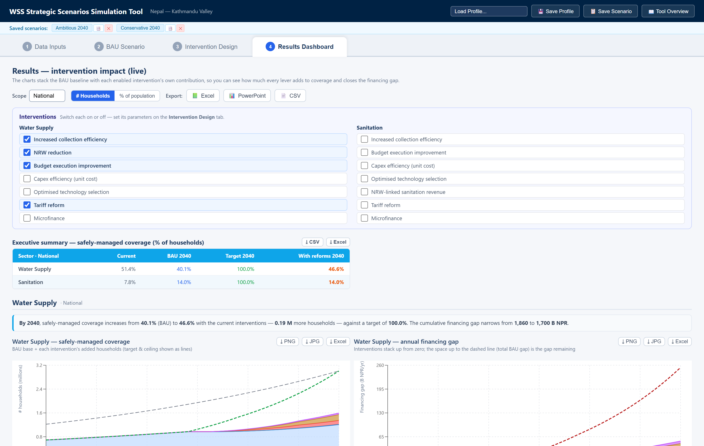

**Figure 2.11. The top of the Results Dashboard.** The Scope dropdown and the export buttons sit on
the first row. The Interventions panel switches levers on and off without leaving the tab. The
executive summary table gives the four headline numbers per sector, and the two charts below repeat
them for water supply.

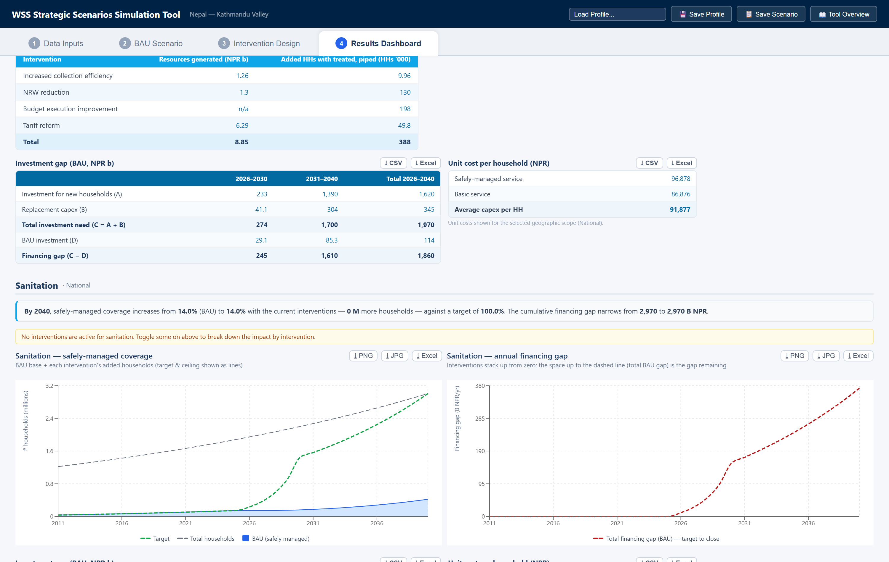

**Figure 2.12. The tables below the charts.** Contribution by intervention credits each lever with
the money it raises and the households it adds. Interventions that stretch an existing budget show
"n/a" for resources. The investment gap table breaks the financing gap into its parts by period.
The sanitation block below carries an amber banner, because no sanitation intervention is switched
on in this example.

### 2.5.4 The three tables

Each sector block carries three tables, all exportable to CSV and Excel:

- **Contribution by intervention** gives, for each enabled intervention, the finance it mobilizes
  and the safely managed households it adds by the final year. Cost-side and budget-execution
  interventions show "n/a" for finance, because they stretch an existing budget rather than raise
  new money. Every figure is marginal and depends on the order of the list, so running one
  intervention alone will not reproduce its row.
- **Investment gap (BAU)** breaks the financing gap into its parts by period: investment for new
  households, replacement capital, total investment need, BAU investment, and the gap between them.
- **Unit cost per household** gives the safely managed cost, the basic cost, and the average
  capital cost per household.

### 2.5.5 Intervention toggles and export files

Three buttons at the top right export the whole scenario:

| Button | Produces |
|---|---|
| **📗 Excel** | A workbook with a forecast sheet and an intervention sheet for each sector |
| **📊 PowerPoint** | The branded deck, covering every area that was entered |
| **📄 CSV** | One file with the same per-sector forecast blocks |

Individual charts and tables also carry their own download buttons, so a single exhibit can be
pulled without exporting everything.

Two points on scope. The **📊 PowerPoint** deck follows the entry mode from tab 1 and covers every
area entered, so it is not affected by the Scope dropdown. The **📗 Excel** and **📄 CSV** exports
always send the primary dataset, whatever the Scope dropdown is showing.

---

*Screenshots show the Nepal Kathmandu Valley demonstration dataset at national scope, with four
water supply interventions enabled.*
